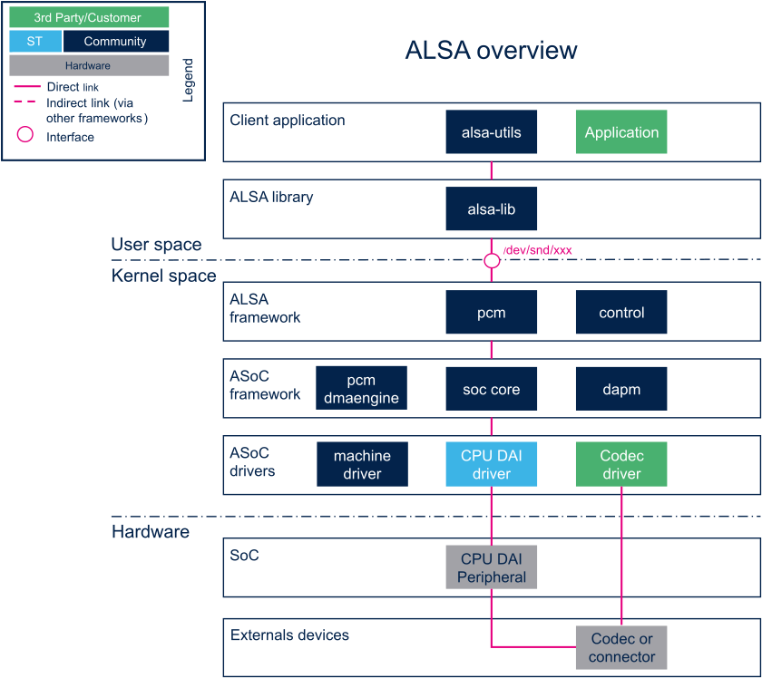

# ASLA 子系统（一）概述

ALSA （Advanced Linux sound architecture）框架为 Linux 提供了全面的音频功能，包括以模拟或数字格式录制和播放音频流，以及路由和混音功能。ALSA 还支持音频中间件，例如 PulseAudio、Gstreamer 或 Android。

## 系统概述

### 组件描述

#### 用户应用层  

- Client Application（客户端应用）  
    - alsa-utils：ALSA 的用户空间工具集，如 aplay、arecord 等，用于播放和录制音频。
    - Application：用户开发的应用程序，如音乐播放器、音频处理软件等，它们通过 ALSA 库与底层交互。  
- ALSA Library（ALSA 库）  
    - alsa-lib：提供用户空间 API，供应用程序访问 ALSA 驱动。例如，snd_pcm_open() 用于打开 PCM 设备。

#### 内核空间

- ALSA Framework（ALSA 框架）
    - pcm：管理 PCM（脉冲编码调制）音频流，处理音频数据的传输。  
    - control：用于控制音量、增益、音频路由等。  
- ASoC Framework（ASoC 框架）  
    - pcm dmaengine：处理音频数据的 DMA 传输。
    - soc core：ASoC 框架的核心组件，管理音频子系统的整体行为。
    - dapm（Dynamic Audio Power Management）：用于动态控制音频通路的电源管理，优化功耗。
- ASoC Drivers（ASoC 驱动层）
    - machine driver（机器驱动）：定义音频系统的整体连接，包括 CPU、Codec 及其交互方式。
    - CPU DAI driver（数字音频接口驱动）：负责 SoC 内部的音频接口，如 I2S、SAI、PCM 等。
    - Codec driver（编解码器驱动）：驱动外部音频编解码器（如果存在）。

#### 硬件层

- SoC
    - CPU DAI Peripheral（数字音频接口外设）：如 I2S、SAI（串行音频接口）等，负责音频数据的传输。

- External Devices（外部设备）
    - Codec or connector（编解码器或连接器）：外部音频硬件，如 DAC（数模转换器）、ADC（模数转换器）、耳机放大器等。
